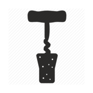

# Uncorked API  

### Use: Provides JWT auth for registering users, secure login, and protected endpoints. Provides database for user profile information and wine entry history.  

## API Documentation:  
### Create User Endpoint
#### `POST /user`  
&nbsp;&nbsp;&nbsp;Creates user profile storing all profile info in Express database with hash encrypted password.
#### Sample Request:  
&nbsp;&nbsp;&nbsp;newUser: {  
    &nbsp;&nbsp;&nbsp;&nbsp;&nbsp;&nbsp;&nbsp;&nbsp;username: text required,  
    &nbsp;&nbsp;&nbsp;&nbsp;&nbsp;&nbsp;&nbsp;&nbsp;password: text required
}  

#### Sample Response:  
&nbsp;&nbsp;&nbsp;newUser: {  
    &nbsp;&nbsp;&nbsp;&nbsp;&nbsp;&nbsp;&nbsp;&nbsp;user_id: generated integer,  
    &nbsp;&nbsp;&nbsp;&nbsp;&nbsp;&nbsp;&nbsp;&nbsp;username: string,  
    &nbsp;&nbsp;&nbsp;&nbsp;&nbsp;&nbsp;&nbsp;&nbsp;password: string
}  
  
### Login Endpoint  
#### `POST /auth/login`  
&nbsp;&nbsp;&nbsp;Provides bcrypted secure login with JWT auth token protection.  
#### Sample Request:  
&nbsp;&nbsp;&nbsp;{  
    &nbsp;&nbsp;&nbsp;&nbsp;&nbsp;&nbsp;username: text required,  
    &nbsp;&nbsp;&nbsp;&nbsp;&nbsp;&nbsp;password: text required  
&nbsp;&nbsp;&nbsp;}
#### Sample Response:  
&nbsp;&nbsp;&nbsp;&nbsp;&nbsp;&nbsp;&nbsp;&nbsp;authToken: string  
&nbsp;&nbsp;&nbsp;Object: {  
    &nbsp;&nbsp;&nbsp;&nbsp;&nbsp;&nbsp;&nbsp;&nbsp;user_id: integer,  
    &nbsp;&nbsp;&nbsp;&nbsp;&nbsp;&nbsp;&nbsp;&nbsp;username: string,  
    &nbsp;&nbsp;&nbsp;&nbsp;&nbsp;&nbsp;&nbsp;&nbsp;password: string  
    &nbsp;&nbsp;&nbsp;}  
  
### Wine Endpoints  
#### `GET /wine/:user_id`  
&nbsp;&nbsp;&nbsp;Retrieves a collection of response objects of the user's wine entries since their profile was created. Requires authentication.  
#### Sample Request:  
&nbsp;&nbsp;&nbsp;{  
    &nbsp;&nbsp;&nbsp;&nbsp;&nbsp;&nbsp;user_id: integer required,  
&nbsp;&nbsp;&nbsp;}  
#### Sample Response:  
&nbsp;&nbsp;&nbsp;Object(s): [{   
    &nbsp;&nbsp;&nbsp;&nbsp;&nbsp;&nbsp;&nbsp;&nbsp;user_id: integer,  
    &nbsp;&nbsp;&nbsp;&nbsp;&nbsp;&nbsp;&nbsp;&nbsp;wine_id: integer,  
    &nbsp;&nbsp;&nbsp;&nbsp;&nbsp;&nbsp;&nbsp;&nbsp;winemaker: string,  
    &nbsp;&nbsp;&nbsp;&nbsp;&nbsp;&nbsp;&nbsp;&nbsp;wine_type: string,  
    &nbsp;&nbsp;&nbsp;&nbsp;&nbsp;&nbsp;&nbsp;&nbsp;wine_name: string,  
    &nbsp;&nbsp;&nbsp;&nbsp;&nbsp;&nbsp;&nbsp;&nbsp;varietal: string,  
    &nbsp;&nbsp;&nbsp;&nbsp;&nbsp;&nbsp;&nbsp;&nbsp;vintage: integer,  
    &nbsp;&nbsp;&nbsp;&nbsp;&nbsp;&nbsp;&nbsp;&nbsp;region: string,  
    &nbsp;&nbsp;&nbsp;&nbsp;&nbsp;&nbsp;&nbsp;&nbsp;tasting_notes: string,  
    &nbsp;&nbsp;&nbsp;&nbsp;&nbsp;&nbsp;&nbsp;&nbsp;rating: integer,  
    &nbsp;&nbsp;&nbsp;&nbsp;&nbsp;&nbsp;&nbsp;&nbsp;img_url: string,  
&nbsp;&nbsp;&nbsp;}]  
#### `POST /wine/:user_id`  
&nbsp;&nbsp;&nbsp;Saves wine entries to the logged in user's profile. Requires authentication.  
#### Sample Request:  
&nbsp;&nbsp;&nbsp;Object(s): {  
    &nbsp;&nbsp;&nbsp;&nbsp;&nbsp;&nbsp;&nbsp;&nbsp;user_id: integer required,  
    &nbsp;&nbsp;&nbsp;&nbsp;&nbsp;&nbsp;&nbsp;&nbsp;winemaker: text required,  
    &nbsp;&nbsp;&nbsp;&nbsp;&nbsp;&nbsp;&nbsp;&nbsp;wine_type: text required,  
    &nbsp;&nbsp;&nbsp;&nbsp;&nbsp;&nbsp;&nbsp;&nbsp;wine_name: text,  
    &nbsp;&nbsp;&nbsp;&nbsp;&nbsp;&nbsp;&nbsp;&nbsp;varietal: text,  
    &nbsp;&nbsp;&nbsp;&nbsp;&nbsp;&nbsp;&nbsp;&nbsp;vintage: integer,  
    &nbsp;&nbsp;&nbsp;&nbsp;&nbsp;&nbsp;&nbsp;&nbsp;region: text,  
    &nbsp;&nbsp;&nbsp;&nbsp;&nbsp;&nbsp;&nbsp;&nbsp;tasting_notes: text,  
    &nbsp;&nbsp;&nbsp;&nbsp;&nbsp;&nbsp;&nbsp;&nbsp;rating: integer,  
    &nbsp;&nbsp;&nbsp;&nbsp;&nbsp;&nbsp;&nbsp;&nbsp;img_url: text,  
&nbsp;&nbsp;&nbsp;}  
#### Sample Response:  
&nbsp;&nbsp;&nbsp;Object(s): {  
    &nbsp;&nbsp;&nbsp;&nbsp;&nbsp;&nbsp;&nbsp;&nbsp;user_id: integer,  
    &nbsp;&nbsp;&nbsp;&nbsp;&nbsp;&nbsp;&nbsp;&nbsp;wine_id: integer,  
    &nbsp;&nbsp;&nbsp;&nbsp;&nbsp;&nbsp;&nbsp;&nbsp;winemaker: string,  
    &nbsp;&nbsp;&nbsp;&nbsp;&nbsp;&nbsp;&nbsp;&nbsp;wine_type: string,  
    &nbsp;&nbsp;&nbsp;&nbsp;&nbsp;&nbsp;&nbsp;&nbsp;wine_name: string,  
    &nbsp;&nbsp;&nbsp;&nbsp;&nbsp;&nbsp;&nbsp;&nbsp;varietal: string,  
    &nbsp;&nbsp;&nbsp;&nbsp;&nbsp;&nbsp;&nbsp;&nbsp;vintage: integer,  
    &nbsp;&nbsp;&nbsp;&nbsp;&nbsp;&nbsp;&nbsp;&nbsp;region: string,  
    &nbsp;&nbsp;&nbsp;&nbsp;&nbsp;&nbsp;&nbsp;&nbsp;tasting_notes: string,  
    &nbsp;&nbsp;&nbsp;&nbsp;&nbsp;&nbsp;&nbsp;&nbsp;rating: integer,  
    &nbsp;&nbsp;&nbsp;&nbsp;&nbsp;&nbsp;&nbsp;&nbsp;img_url: string,  
&nbsp;&nbsp;&nbsp;}   
  
### Technologies:  
&nbsp;&nbsp;&nbsp;**Express**  
&nbsp;&nbsp;&nbsp;**Node**  
&nbsp;&nbsp;&nbsp;**Knex**  
&nbsp;&nbsp;&nbsp;**Postgrator**  
&nbsp;&nbsp;&nbsp;**Mocha, Chai, Supertest**  
&nbsp;&nbsp;&nbsp;**JSON Web Token, bcryptjs**